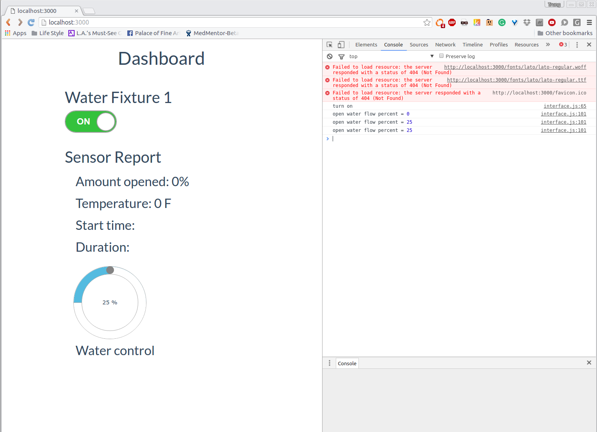

Particle Webcontrol with Stepper Motor
--------------------

Full-stack Particle Microcontroller and a NodeJS Web App in order to control stepper motor.

This simple app serves the purposes and provide abstraction to control stepper motor wirelessly and through a front-end webapp with automation.

Building backend with NodeJS v4.4.1 LTS & ExpressJS for simple front-end with HTML5/CSS/jQuery

Project Goals
------------

+ The stepper motor should have the capability to be controlled remotely using a cloud based architecture. This will involve building a REST server with cloud end-points that can be queried remotely. For example:

(http://(ipaddress)/micro-controller

+ The server should also have the ability to receive scripted events for automation tasks:

{
script_name: ‘name 1’,
control: [
	{
		Amount_opened: 50,
		Start_time: 2016-04-02T12:10:10
		Duration: 20
}
{
  Amount_opened: 25,
  Start_time: 2016-04-02T12:15:10
  Duration: 15
}
]
}

+ A webcontrol that will allow access to turn the micro-controller on/off at different rates and at different levels. Parameters that are associated with micro-controller are:
  + Amount of percentage open (as with 100 being fully open and 0 being fully closed)

Installation
------------
+ Recommended download and install NodeJS v4.4.1 LTS --> https://nodejs.org/en/
+ Inside the project folder run 'node app.js' and navigate to http://localhost:3000

* For detail documentation, please read -->
https://docs.particle.io/guide/getting-started/intro/photon/

Version History
---------------

v0.12:
  + Optimized network control signal delay between micro-controller and NodeJS server. The idea is to push the control logics as much as it can on the NodeJS server while reserve the signal control on the micro-controller side.

Credit
-------
Inspire by https://www.particle.io/prototype

Support
-------
Developed by http://ntt2k.io
 -- Mon Mar 28 09:37:21 PDT 2016
